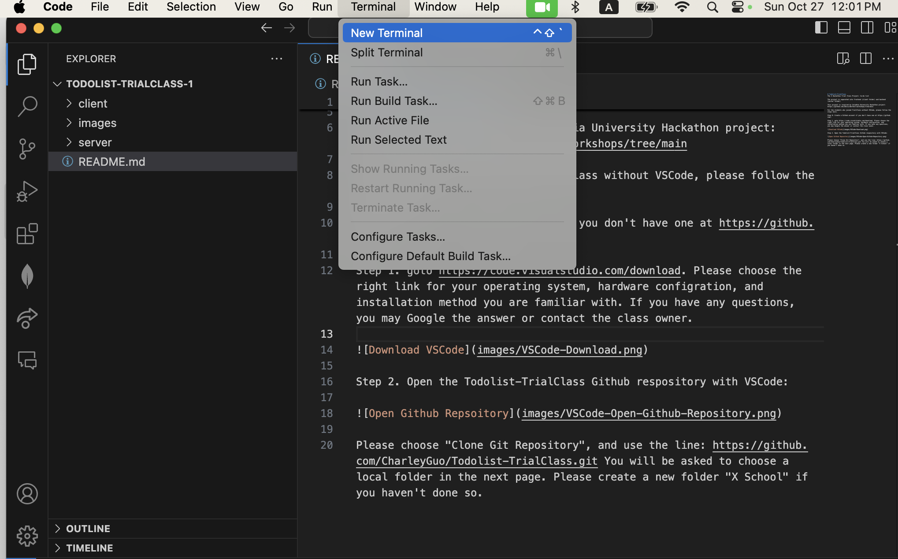

# Todolist-TrialClass
This is the X School's X Hackathon Trial Class Project: to-do list.

The project is separated into frontend (client folder) and backend (server folder). 

This project is inspired by Columbia University Hackathon project: https://github.com/adicu/devfest-workshops/tree/main. Please refer https://react.dev/learn, https://create-react-app.dev/ for more tutorial of React development.

For the students who joined TrailClass without VSCode, please follow the steps here:

Step 0: Create a Github account if you don't have one at https://github.com/. 

Step 1. goto https://code.visualstudio.com/download. Please choose the right link for your operating system, hardware configration, and installation method you are familiar with. If you have any questions, you may Google the answer or contact the class owner. 

Step 2. Open the Todolist-TrialClass Github respository with VSCode:

Please choose "Clone Git Repository", and use the line: https://github.com/CharleyGuo/Todolist-TrialClass.git You will be asked to choose a local folder in the next page. Please create a new folder "X School" if you haven't done so.

Step 3. Open a terminal in VSCode:

Step 4 (backend setup). Using MongoDB Atlas
Go to https://www.mongodb.com/products/platform/atlas-database, click GET STARTED in the top right, and deploy a free cluster. With Atlas, MongoDB does the hosting for you, making it easier to use and easier to scale. Follow steps to build a database and add a user. 0.0.0.0/0 for access from any IP. Get the python connection string. 
