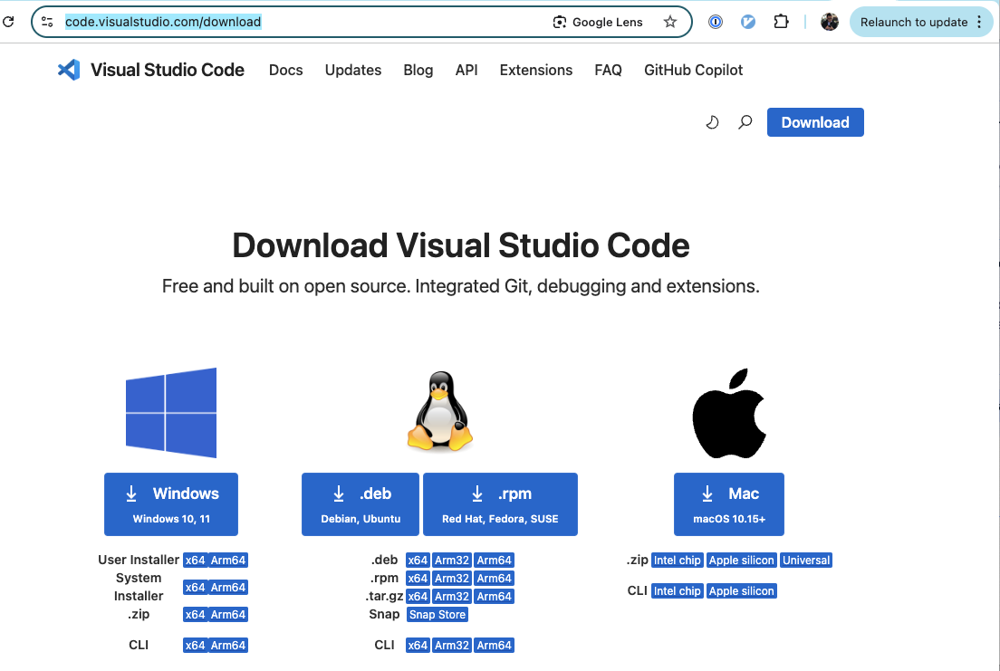
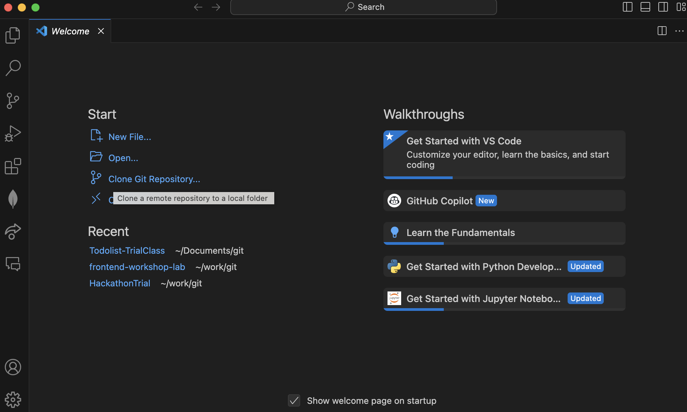

# Todolist-TrialClass
The X Hackathon Trial Class Project: to-do list

The project is separated into frontend (client folder) and backend (server folder)

This project is inspired by Columbia University Hackathon project: https://github.com/adicu/devfest-workshops/tree/main 

For the students who joined TrailClass without VSCode, please follow the steps here:

Step 0: Create a Github account if you don't have one at https://github.com/. 

Step 1. goto https://code.visualstudio.com/download. Please choose the right link for your operating system, hardware configration, and installation method you are familiar with. If you have any questions, you may Google the answer or contact the class owner. 

Step 2. Open the Todolist-TrialClass Github respository with VSCode:

Please choose "Clone Git Repository", and use the line: https://github.com/CharleyGuo/Todolist-TrialClass.git You will be asked to choose a local folder in the next page. Please create a new folder "X School" if you haven't done so.